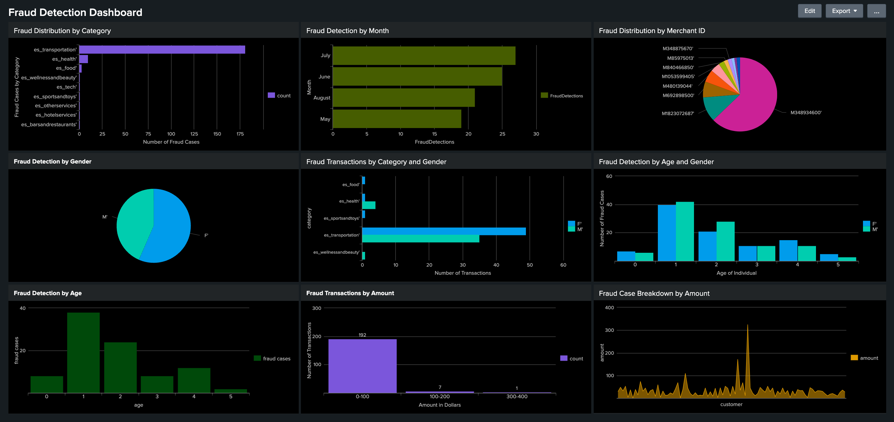
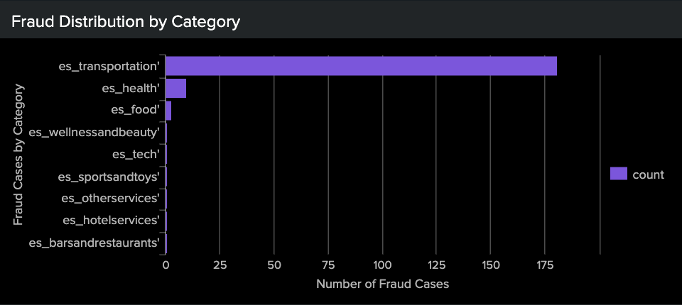
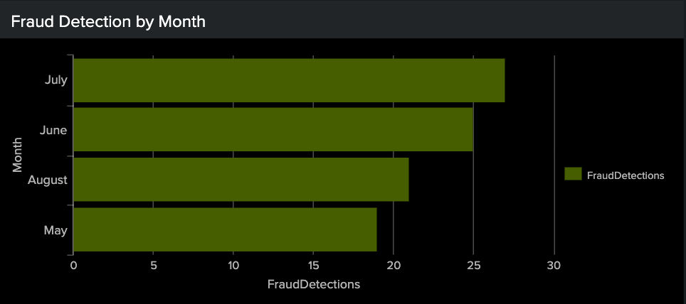
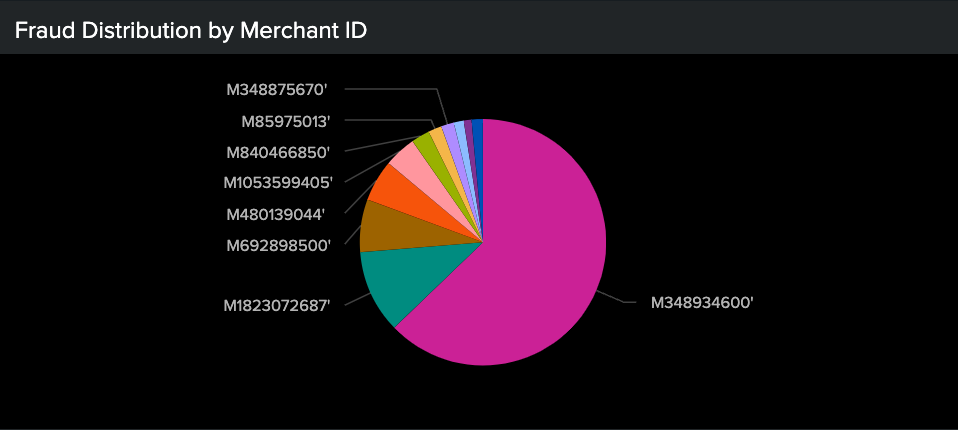
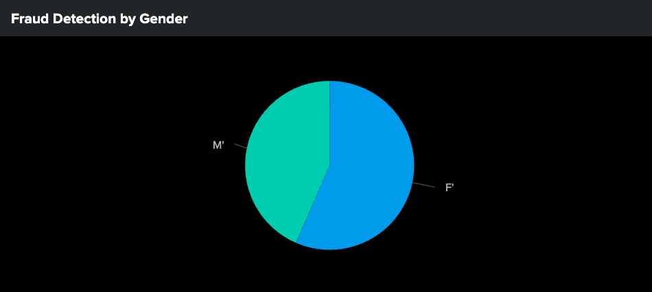
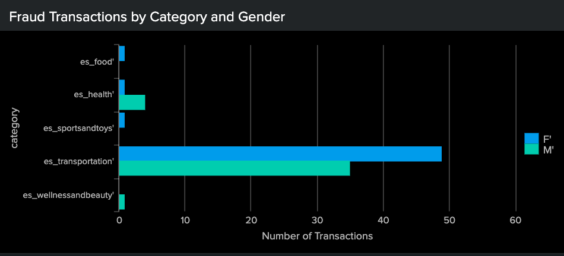
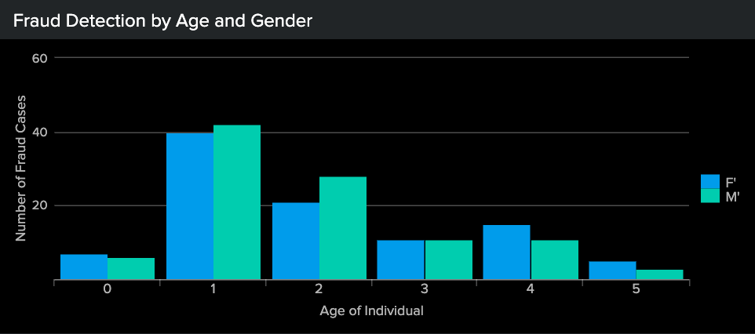
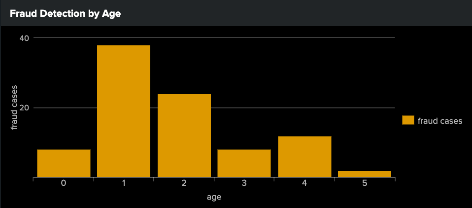
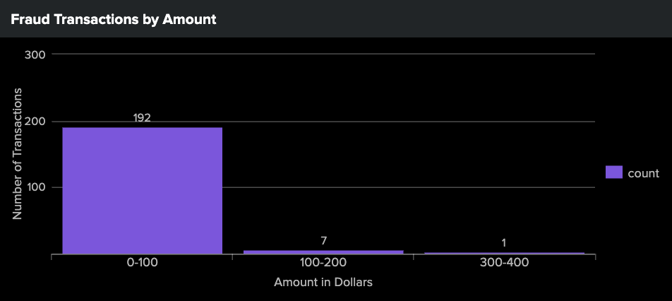
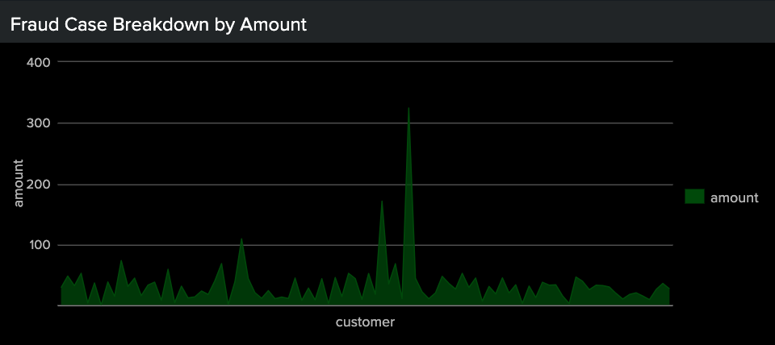

<h1>Fraud-Analysis---Splunk-Dashboard-to-Combat-Financial-Fraud</h1>

<h3>About the Project</h3>

In the "Fraud Analysis - Creating a Splunk Dashboard to Combat Financial Fraud" project, I designed a comprehensive Splunk dashboard tailored to simulate real-world financial data and scenarios. This project was driven by my passion for data-driven solutions in cybersecurity. The enterprise version of Splunk allowed me to construct a dashboard that monitors transactional integrity across various demographics and transaction categories. Through this process, I honed key skills in data processing, from query formulation to dynamic visualization. I gained hands-on experience with Splunk and data analysis (especially in the context of cybersecurity). I also developed skills in interpreting data fields and identifying key insights, as well as presenting complex data in an accessible format. This project solidified my proficiency with Splunk and data analysis, transforming raw data into a fortress of defense.  
 

 

Here is what I did to create this project... 

<h3>The Dataset</h3>

Data was randomly generated for this project. This dataset consists of payments from various customers made in different periods and amounts. The feature columns include:

Step: This feature represents the month from the start of the simulation. The steps represent four months that the simulation ran virtually.
0: May
1: June
2: July
3: August

Customer: Customer ID

Age: Categorised age
0.0: <= 18
1.0: 19 - 25
2.0: 26 - 35
3.0: 36 - 45
4.0: 46 - 55
5.0: 56 - 65

Gender: Gender of the customer
F: Female
M: Male

Merchant: The merchant's ID. 

Category: Category of the purchase. 

Amount: Amount of the purchase.

Fraud: Target variable that shows if the transaction is fraudulent - 1 or non-fraudulent - 0.

<h3>Creating the Dashboard</h3>
<h4>Search Queries</h4>

1. Fraud Detection by Catergories: 
   sourcetype="fraud_detection.csv" | top category  
    
       

2. Fraud Detection by Month: 
   sourcetype="fraud_detection.csv" 
   | eval Month=case(step=0, "May", step=1, "June", step=2, "July", step=3, "August")
   | where fraud=1
   | stats count as FraudDetections by Month
   | sort - FraudDetections 
    
   
   
3. Fraud Distribution by Merchant ID: 
   sourcetype="fraud_detection.csv" | stats sum(amount) by merchant | sort - sum(amount) 
    
   

4. Fraud Detection by Gender: 
   sourcetype="fraud_detection.csv" fraud="1" | chart count over gender 
    
   

5. Fraud Detection by Category and Gender: 
   sourcetype="fraud_detection.csv" fraud="1" | chart count over category by gender 
    
   

6. Fraud Detection by Age and Gender: 
   sourcetype="fraud_detection.csv" 
   | chart count over age by gender  
    
   

7. Fraud Detection by Age: 
   sourcetype="fraud_detection.csv"  age="*" fraud="1" | chart count as "fraud cases" over "age"  
    
   

8. Fraud Detection by Transaction Amount: 
   sourcetype="fraud_detection.csv" | bin amount | stats count by amount 
    
   

9. Fraud Case Analysis by Transaction Amount: 
   sourcetype="fraud_detection.csv" fraud="1" | table customer, amount 
    
   
